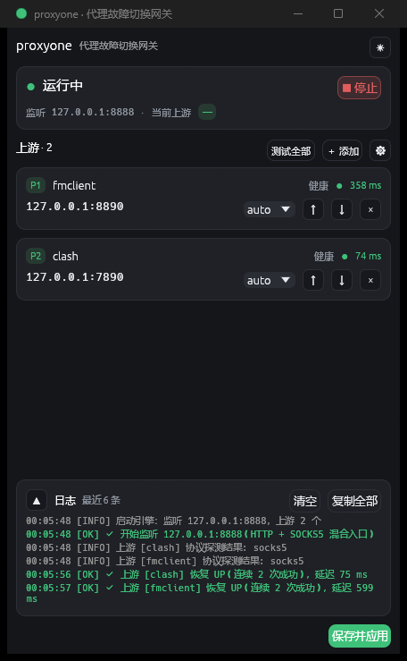
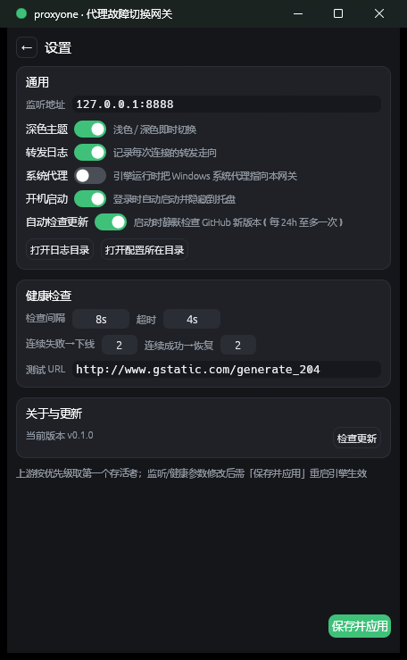

# proxyone

[](https://github.com/zhuchentong/proxy-one/actions/workflows/ci.yml)

[简体中文](README.md) | English

**proxyone** is a lightweight proxy failover gateway: a single local entry point at `127.0.0.1:8888` that aggregates multiple upstream proxies by priority. When a high-priority upstream goes down, traffic fails over automatically — and switches back once it recovers. Applications only ever point at 8888; no manual reconfiguration needed.

> Typical setup: you already run several proxy clients locally (say `127.0.0.1:8890` and `127.0.0.1:7890`); proxyone aggregates them into one stable entry, always using whichever works, and your apps are configured once.

> 轻量级代理故障切换网关：混合 HTTP/SOCKS5 入口，按优先级聚合多个上游代理，健康检查驱动的自动故障切换。

## Screenshots

<p align="center">
  
  &nbsp;&nbsp;&nbsp;&nbsp;
  
</p>
<p align="center"><sub>Left: main window (dark theme, running); right: settings page</sub></p>

## Contents

- [Screenshots](#screenshots)
- [Features](#features)
- [Platform support](#platform-support)
- [Quick start](#quick-start)
- [Graphical interface](#graphical-interface)
- [System proxy](#system-proxy)
- [Run at login](#run-at-login)
- [Auto-update](#auto-update)
- [Configuration](#configuration)
- [How it works](#how-it-works)
- [Project layout](#project-layout)
- [Building & development](#building--development)
- [Known limitations](#known-limitations)
- [License](#license)

## Features

**Core proxying**

- **Mixed entry port**: one port serves both HTTP proxy (CONNECT / absolute-URI) and SOCKS5 traffic; first-byte protocol sniffing, same mechanism as Clash mixed-port.
- **Transparent failover**: when an upstream dial fails, the router switches to the next upstream in-place *before* forwarding any byte to the client; new connections automatically return to higher-priority upstreams after recovery.
- **Health checks**: periodic active probes with consecutive failure/success hysteresis thresholds to prevent flapping.
- **Upstream authentication**: SOCKS5 RFC 1929 username/password and HTTP Basic, passed through per-upstream as configured.

**System integration**

- **System proxy takeover**: one click to point the OS proxy at the gateway, with snapshot/restore, crash self-healing, and conflict protection.
- **Run at login**: per-user setup, no administrator rights required; paths are self-healed after the executable moves.
- **Auto-update**: built on GitHub Releases; downloads are routed through the gateway itself when running (inheriting upstream failover), with triple integrity checks and atomic replacement.

**Observability & experience**

- **Log page**: full-page log browsing with keyword search and per-level filters (INFO / OK / WARN / ERR).
- **Statistics page**: per-upstream health state, cumulative traffic, live rate and peak (sampled every second).
- **Single portable file**: one self-contained Rust binary with a native egui/eframe GUI; the data plane is pure TCP tunnel blind forwarding.
- **Dark & light themes**, plus a `--headless` mode for running without a UI.

## Platform support

| Feature | Windows | Linux |
| --- | --- | --- |
| Proxy engine (mixed entry, failover, health checks) | ✅ | ✅ |
| GUI | ✅ | ✅ (Wayland / X11) |
| Tray icon | ✅ | Planned (KSNI route; currently skipped with a log entry, proxying unaffected) |
| System proxy takeover | WinINet registry with snapshot/restore/conflict protection | Writes `~/.config/environment.d/proxyone.conf`; takes effect on next login, removed on switch-off |
| Run at login | HKCU Run registry key | XDG autostart `~/.config/autostart/proxyone.desktop` (sway needs `dex -a` in-session) |
| Auto-update | ✅ | ✅ (atomic rename replacement on Linux) |
| Headless mode | ✅ | ✅ (a systemd user service is recommended) |

## Quick start

### Download or build

**Option 1 — prebuilt binaries (recommended)**

1. Grab `proxyone.exe` (or `proxyone-linux-x64` on Linux) from the [Releases](https://github.com/zhuchentong/proxy-one/releases) page.
2. Launch it — the GUI opens and proxying starts immediately. On first run a default config is generated in the user config directory (two example upstreams, edit as needed).
3. Point your applications' proxy settings at `127.0.0.1:8888` (HTTP or SOCKS5, either works).

**Option 2 — build from source**

```bash
cargo build --release
```

### Command-line arguments

| Argument | Description |
| --- | --- |
| (none) | Opens the GUI; proxying starts automatically |
| `--headless` | Runs without a UI; logs to the console; `Ctrl+C` for a graceful exit |
| `--minimized` | Starts minimized to the tray (used by the login entry) |
| `--updated` | Internal: delayed start after an auto-update, waiting for the old process to release the listen port |

### Verify

```bash
curl -x http://127.0.0.1:8888 https://www.google.com
curl -x http://127.0.0.1:8888 http://www.gstatic.com/generate_204
curl -x socks5h://127.0.0.1:8888 https://www.google.com
```

All three commands should succeed (`test_curl.bat` in the repository is a batch version of the same checks).

## Graphical interface

### Main window

Compact card layout, default window 440×700:

- **Status card**: running state, listen address, active upstream, cumulative forwarded traffic and live rate.
- **Upstream cards**: priority badge, inline name/address editing, type dropdown (auto/http/socks5), health state with latency coloring, highlight for the upstream in use; per-card traffic stats with live rate, reorder up/down, delete.
- **Test all**: probes every upstream concurrently with a spinner; results are written to the log and latencies refreshed.
- **Add upstream**: the "＋ Add" button expands a form with an optional top-priority placement.
- **Theme**: the "☀/🌙" button in the top bar toggles dark/light and persists immediately.
- Every modification takes effect via "Save & apply", which writes `config.toml` and restarts a running engine with the new configuration.

### Logs & statistics

- **Log panel** (bottom of the main window): the last 200 colored log entries with collapse/expand, per-line selection copy, copy-all, and clear.
- **Log page**: opens from the "↗" button on the log card; full-page browsing with keyword search and per-level filters (INFO / OK / WARN / ERR toggles), a match counter, and copy that follows the active filter; "←" or `Esc` returns to the main view.
- **Statistics page**: opens via the "Stats" button in the main window; per-upstream summary of health state (status / latency / check counts), cumulative traffic and connections, and current rate & peak (sampled every second, peak keeps its timestamp), with a one-click "Reset stats".

### Tray icon

- Three-state icon: green dot = running, gray dot = stopped, red dot = port bind failure; the tooltip shows current state and listen address.
- **Left click**: show/hide the main window (hiding keeps the engine proxying in the background).
- **Right-click menu**: show window / engine running (checked = started) / system proxy (checked = takeover) / test all upstreams / upstream status (health, latency, traffic per upstream) / open config file / quit.
- Closing the window with ✕ hides to the tray; use the tray menu's "Quit" to exit fully.

> Windows 11: if the tray icon is hidden, enable it under taskbar settings, or set `HKCU\Control Panel\NotifyIconSettings\<id>\IsPromoted` to `1`.

### Settings page

Enter via the "⚙" button in the main window; "← Back" or `Esc` returns:

| Section | Contents |
| --- | --- |
| General | Listen address, dark theme, forwarding log, system proxy, run at login, auto update check, open log directory, open config directory |
| Health check | Check interval, per-probe timeout, consecutive fail/success thresholds, test URL |
| About & updates | Current version, check for updates, download progress, restart to finish update |

## System proxy

Both the settings page and the tray menu offer the switch; the state persists across restarts. The mechanism differs per platform (see [Platform support](#platform-support)): on Windows it takes effect immediately; on Linux the written environment.d snippet applies to systemd user sessions at the next login and does not affect already-running programs.

- **Enable**: points the WinINet system proxy (`Internet Settings` registry key) at the listen address and broadcasts the refresh, so running programs pick it up immediately; the previous values (ProxyEnable / ProxyServer / ProxyOverride / AutoConfigURL) are snapshotted to the data directory.
- **Bypass list is appended, never overwritten**: `localhost;127.*;<local>` is added automatically; user entries are preserved verbatim.
- **Disable / exit**: restores the snapshotted original values rather than blanking them; any other proxy previously configured (e.g. 8890) is restored as-is.
- **Crash self-healing**: a system proxy left pointing at this gateway by an abnormal exit is automatically restored on the next start; if the switch was on, the engine re-takes-over after starting.
- **Conflict protection**: takeover is surrendered only when "already taken over (snapshot exists) and changed by another program mid-session", avoiding write races with the other tool.
- The switch turns itself off when the engine stops, and re-takes-over when the engine resumes.

## Run at login

The settings-page switch, per user and without administrator rights:

- **Windows**: writes the registry Run key (`HKCU\...\Run\proxyone`).
- **Linux**: writes an XDG autostart desktop entry (`~/.config/autostart/proxyone.desktop`).
- **At login**: the app starts with `--minimized` and hidden, so the proxy is ready immediately.
- **Path self-healing**: if the executable moves or the app is renamed, the saved path is repaired on the next start (legacy-name leftovers are cleaned up and the autostart intent migrates automatically).
- **State follows the system**: the GUI reads the real state at every launch instead of trusting its memory.

> sway note: sway does not parse the XDG autostart directory itself; add `exec dex -a` to your sway config (or run `proxyone --headless` as a systemd user service).

## Auto-update

The "About & updates" card checks for, downloads, and applies updates manually; the "auto check" switch (on by default) silently checks at startup at most once every 24 hours.

- **Source**: GitHub Releases (repository taken from the `repository` field in `Cargo.toml`); only the latest release is used — pre-releases are never offered.
- **Download channel**: while the engine is running, downloads are routed through the gateway itself, inheriting upstream failover; it falls back to a direct connection on failure.
- **Integrity checks**: Content-Length, `sha256` checksum, and the executable header must all match before anything is written.
- **Atomic replacement**: on Windows it uses "a running exe can be renamed" to perform the swap `current exe → .old`, `.new → current name`; on Linux it is a rename-over. The new version then detaches and starts while the old process exits; the system proxy is restored first, and the new instance re-takes-over per the persisted intent.
- **Rollback**: `.old` retains the previous version; if the exe directory is read-only or another error occurs, the update aborts with a message, and `.old` can be renamed back manually.
- Check/download failures are surfaced gently or silently; proxying is never affected.

## Configuration

### Example

```toml
[general]
listen = "127.0.0.1:8888"

[health]
interval_secs = 8        # check interval
timeout_secs = 4         # per-probe timeout
test_url = "http://www.gstatic.com/generate_204"
fail_threshold = 2       # N consecutive failures → mark DOWN
success_threshold = 2    # N consecutive successes → recover (anti-flapping)

[update]
auto_check = true        # silent GitHub update check at startup (at most once per 24h)

[[upstreams]]
name = "fmclient"
addr = "127.0.0.1:8890"
type = "auto"            # auto | http | socks5
priority = 1             # lower value = higher priority
# username = "u"         # optional: upstream auth (SOCKS5 RFC 1929 / HTTP Basic)
# password = "p"

[[upstreams]]
name = "clash"
addr = "127.0.0.1:7890"
type = "auto"
priority = 2
```

### Loading rules

- **Search order**: the exe's directory (portable mode) → the user config directory → the working directory; if none exists, a default config is generated in the user config directory.
- A `config.toml` next to the exe always wins, making portable use easy; it still works when the exe sits in a read-only directory.
- **User config directory**: `%LOCALAPPDATA%\proxyone` on Windows, `$XDG_CONFIG_HOME/proxyone` (default `~/.config/proxyone`) on Linux.
- **Data directory** (state files, logs): the same path as the config directory on Windows, `$XDG_DATA_HOME/proxyone` (default `~/.local/share/proxyone`) on Linux.
- On Windows, a legacy-named data directory (`%LOCALAPPDATA%\failgate`) is migrated automatically as a whole.
- **Engine logs** go to `<data dir>/logs/proxyone.log`, rotating to `proxyone.log.1` past 5 MB; the settings page offers shortcuts to open the log and config directories.

### Upstream authentication

`username` / `password` are optional; leave them empty for no auth:

- **SOCKS5 upstreams**: the RFC 1929 username/password subnegotiation is performed; the greeting offers both `0x02` (preferred) and `0x00` (fallback) methods, so either server choice works.
- **HTTP upstreams**: CONNECT tunnels and plain-HTTP forwarded requests automatically carry `Proxy-Authorization: Basic`; it is only added toward the HTTP-type upstream and never leaked to target sites.
- Failed authentication is treated as upstream failure: the upstream is marked DOWN and traffic switches to the next one.

## How it works

1. **Protocol detection**: with `type = "auto"`, a SOCKS5 handshake is sent to the upstream; a `0x05` response marks SOCKS5, anything else HTTP. Detection results are cached, or the type can be fixed manually.
2. **Active health checks**: every `interval_secs` a GET to `test_url` goes through each upstream (expecting 2xx) with latency recorded; `fail_threshold` consecutive failures mark DOWN, `success_threshold` consecutive successes recover UP; a round runs immediately at startup.
3. **Passive fast failover**: a failed dial on a new connection (refused / handshake error) marks the upstream DOWN immediately and switches in-place before any byte is forwarded, also triggering a full check round; a target-side failure discovered after the tunnel is established (non-2xx CONNECT, SOCKS5 error code) does not mark DOWN but still switches.
4. **Routing and switch-back**: every new connection picks the highest-priority UP upstream; recovered high-priority upstreams regain new connections automatically. If everything is DOWN, dialing still proceeds by priority.
5. **No connection migration**: switching affects new connections only; established connections keep their upstream until they end.

## Project layout

```text
src/
  main.rs               Entry: CLI args (--headless / --minimized / --updated), GUI & headless startup
  config.rs             TOML config model, load/save (defaults fallback + unit tests)
  httpc.rs              Minimal HTTPS client (native-tls, CONNECT tunnel via the gateway)
  util.rs               Small utilities (human-readable byte formatting, etc.)
  update.rs             Auto-update: GitHub Releases check, gateway-first download, atomic replacement
  platform/             Platform layer: business code targets one API; platform details stay here
    mod.rs              Module switch: autostart / sysproxy via #[cfg] + #[path] file pairs
    dirs.rs             User data/config directories & XDG base-dir resolution
    desktop.rs          Desktop interop: open paths in file manager / text editor
    autostart_windows.rs  Run at login (Windows): HKCU Run registry + path self-healing & rename migration
    autostart_linux.rs    Run at login (Linux): XDG autostart desktop entry
    sysproxy_windows.rs   System proxy (Windows): WinINet registry + snapshot/crash-healing/conflict protection
    sysproxy_linux.rs     System proxy (Linux): environment.d snippet
    tray.rs             Tray: three-state icon / context menu (Windows live, Linux degrades at runtime)
  ui/
    ui.rs               App state & eframe orchestration (logic: tray/close interception + layout)
    update_flow.rs      Update UI orchestration: check/download threads & state machine
    cards.rs            Main view & cards: status / upstream / add / logs / footer
    logs.rs             Dedicated log page: keyword & level filters, match count, filtered copy
    stats.rs            Dedicated statistics page: per-upstream health, traffic, rate & peak
    settings.rs         Settings page: general / health check / about & updates
    theme.rs            Dark/light palettes, Visuals tuning, CJK font loading
    widgets.rs          Basic widgets: cards, pill badges, toggle switch, buttons, log coloring
  engine/
    handle.rs           Engine lifecycle (background thread + tokio runtime, start/stop)
    state.rs            Shared state: snapshot, 200-entry log ring, EngineCtx
    rates.rs            Traffic rate sampling: 1 s deltas over cumulative bytes → current rate & peak
    filelog.rs          Log persistence: append + 5 MB rotation
    server.rs           Inbound listener + first-byte protocol sniffing (0x05 SOCKS5 / HTTP / 0x04 rejected)
    http.rs             Inbound HTTP: CONNECT tunnels, absolute-URI rewrite, hop-by-hop stripping
    socks5.rs           Inbound SOCKS5: no-auth handshake + CONNECT
    router.rs           Upstream selection: priority-ordered pure fn + in-place per-connection failover
    health.rs           Health-check loop + hysteresis transitions (pure fns)
    upstream.rs         Upstream dial entry: protocol probe/cache + DialError classification
    upstream/
      dial_http.rs      HTTP CONNECT upstream dialing (with Basic auth)
      dial_socks5.rs    SOCKS5 upstream dialing (RFC 1929 username/password)
      mock.rs           Test-only mock upstream (compiled in test builds only)
    b64.rs              Standard padded Base64 (for auth headers)
    stream.rs           Tunnel stream utilities: PrefixedStream (prefix replay), read_head, CountingStream (live traffic accounting)
    url.rs              host:port / authority / probe-URL parsing
```

## Building & development

```bash
cargo build --release
```

The artifact is a self-contained single file `target/release/proxyone` (`proxyone.exe` on Windows). Unit tests: `cargo test` (covering config parsing, version comparison, GitHub asset filtering, sha256 parsing, URL/authority parsing, HTTP rewrite semantics, router candidate ordering, health-check hysteresis, header reader, etc., plus platform-specific cases).

### Linux build dependencies (Manjaro / Arch)

```bash
sudo pacman -S --needed rust gtk3 openssl pkgconf
cargo build --release
```

The GUI requires a Wayland or X11 session; `noto-fonts-cjk` is recommended for CJK text. On Debian/Ubuntu the equivalent packages are `libgtk-3-dev pkg-config libssl-dev`.

### Development notes

- The GUI renders with **wgpu** (DX12/Vulkan, remote-desktop friendly); the glow (OpenGL) backend was verified to produce blank windows — not only in remote sessions but also locally on NVIDIA drivers (re-confirmed and reverted in 2026-09); do not switch back.
- This repository is built with the GNU toolchain on Windows (a directory-level `rustup override`); to use MSVC instead, install the "Desktop development with C++" workload in Visual Studio Installer, then run `rustup override unset`.
- crates mirror: under a TUN virtual adapter, TLS handshakes from cargo to some mirror hosts get intercepted; this repository pins the Aliyun mirror via a project-level `.cargo/config.toml` (affects this repo only).

## Known limitations

**Proxying semantics**

- No UDP proxying (SOCKS5 supports CONNECT only; BIND / UDP ASSOCIATE are explicitly rejected)
- Inbound SOCKS5 supports no-auth only (the listener binds loopback only, so local use needs no auth); SOCKS4 requests are rejected
- Plain-HTTP forwarding forces `Connection: close` (one connection per request; browsers and WebSocket are unaffected — ws goes through CONNECT)
- Health-check `test_url` supports `http://` only (the default generate_204 is http)

**Platform & deployment**

- Linux tray icon not yet supported (planned; the KSNI route is preferred — the GUI runs fine, just no tray)
- Linux system proxy is an environment.d snippet (effective at next login); no live takeover of running programs
- The default 8-second health checks amount to ~10k generate_204 probes per upstream per day — harmless by design; adjust the interval in the GUI if desired

## License

Licensed under either of [MIT](LICENSE-MIT) or [Apache-2.0](LICENSE-APACHE) at your option.
